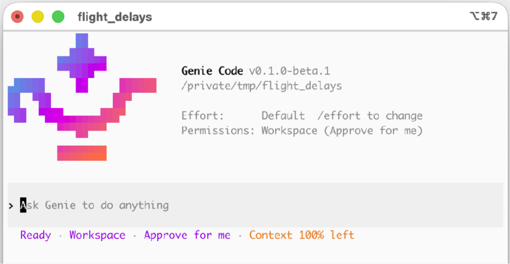

# Genie Code CLI

**A coding agent specialized for Data and AI work.**

Genie Code CLI runs locally in your terminal and is tuned for data and AI work on Databricks. Use it to ask questions about data in Unity Catalog, train and serve models, ship apps, and do work outside of Databricks too. 

**Learn more in the [official documentation](https://docs.databricks.com/aws/en/genie-code/genie-code-cli).**



> Note: Genie Code CLI is in Beta as its capabilities continue to evolve.

## Get started
1. [Install the latest version of the Databricks CLI.](https://docs.databricks.com/aws/en/dev-tools/cli/install)
2. Install Genie Code CLI with the command for your operating system.

   ### macOS and Linux

   ```sh
   curl -fsSL https://github.com/databricks/genie-code-cli/releases/latest/download/install.sh | bash
   ```

   ### Windows

   ```powershell
   powershell -ExecutionPolicy Bypass -c "irm https://github.com/databricks/genie-code-cli/releases/latest/download/install.ps1 | iex"
   ```

3. Start an interactive session by running `genie` in your project directory. 

> Note: You must use a workspace with [Unity Gateway](https://docs.databricks.com/aws/en/resources/feature-region-support#model-serving-features-availability) enabled.

## Reporting issues

Found a bug or have a feature request? [Open an issue](https://github.com/databricks/genie-code-cli/issues). Please do not include credentials, tokens, or confidential information in issue reports.

For security vulnerabilities, follow the [security policy](SECURITY.md) instead of opening a public issue.

## License

See [LICENSE](LICENSE).
